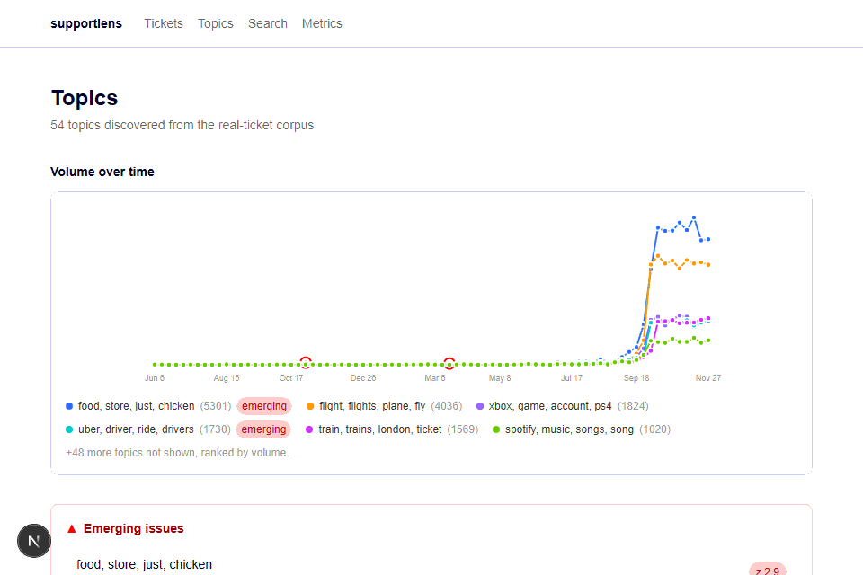
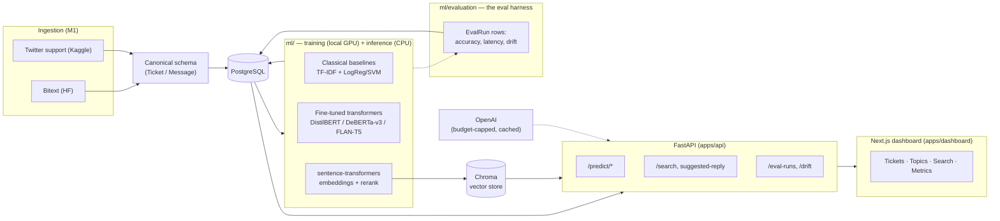
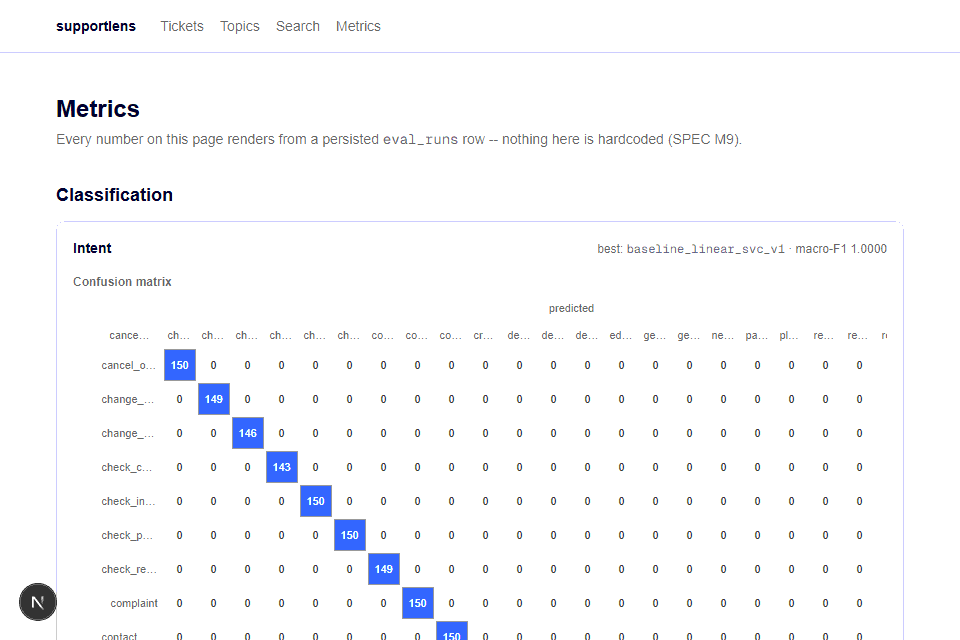

# supportlens

**Customer Support Intelligence Platform** — an end-to-end NLP system that ingests raw customer support
conversations and turns them into structured, searchable, actionable intelligence: intent and urgency
classification, entity extraction, sentiment trajectories, thread summaries, emerging-issue detection,
semantic search over resolved cases, and RAG-drafted reply suggestions — all served behind a FastAPI
backend with a Next.js analytics dashboard.

> I built a platform that classifies, extracts, summarizes, clusters, and searches customer support
> tickets — with classical baselines, fine-tuned transformers, and RAG — deployed end-to-end with FastAPI,
> Next.js, PostgreSQL, and a vector store.

**Status:** all ten modules (M0–M10) complete. See [SPEC.md](SPEC.md) for the full spec and
[docs/decisions.md](docs/decisions.md) for the design-decision log behind every non-obvious choice below.



## Quickstart

**Just want to see it working?** Three commands, only Docker + `make` + `git` required — no local Python
setup:

```bash
git clone <repo-url> && cd supportlens
cp .env.example .env
make demo
```

`make demo` builds and starts every service (`api`, `dashboard`, `postgres`, `chroma`), then seeds a
curated ~339-ticket real dataset — every capability below is populated, not empty. Open
http://localhost:3000, or walk through [DEMO.md](DEMO.md) for a guided 5-minute tour.

**Developing or retraining?**

```bash
cp .env.example .env
make install      # uv sync + pre-commit hooks
make up            # docker compose: api + dashboard + postgres + chroma, waits for healthy
make test           # unit + integration tests
```

`make up` requires Docker Desktop running. `make` itself requires GNU Make (`winget install
ezwinports.make` on Windows). See `docs/mX-how-to-run-locally.md` for each module's GPU training
instructions (M3–M6 fine-tunes run locally on the builder's own NVIDIA GPU, never in this repo's runtime —
see [CLAUDE.md](CLAUDE.md)'s hard rules).

## Architecture



**Stack:** FastAPI + Pydantic v2 + SQLAlchemy 2, PostgreSQL, Chroma, sentence-transformers, Hugging Face
Transformers (DistilBERT / DeBERTa-v3-small / FLAN-T5-small), spaCy, Next.js (App Router) + Tailwind, OpenAI
(seed labeling / RAG drafting / LLM-judge only, hard-capped and cached). Training runs locally on an NVIDIA
GPU; every service in `docker compose up` is CPU-only.

## The nine capabilities

| # | Capability | Module | Baseline | Transformer | Real result |
|---|---|---|---|---|---|
| 1 | Intent classification | M2/M3 | TF-IDF + LinearSVC | DistilBERT | Baseline wins (0.9990 vs 0.9975 macro-F1 test) — kept, honestly reported |
| 2 | Urgency classification | M2/M3 | TF-IDF + LinearSVC | DeBERTa-v3-small | Transformer wins **+0.115** macro-F1 (0.794 → 0.910) — deployed |
| 3 | Entity extraction | M4 | Regex/rules | BERT-base-cased | Rules win overall (0.585 vs 0.447 micro-F1) — hybrid routing per entity type |
| 4 | Sentiment/emotion trajectory | M5 | TF-IDF + LinearSVC | DistilBERT | Transformer wins on both (+0.064 sentiment, +0.106 emotion macro-F1) — deployed |
| 5 | Thread summarization | M6 | Lead-k extractive | FLAN-T5-small | Transformer wins **+0.16–0.17** ROUGE-1 — deployed; LLM-judge 3.44/5 faithfulness |
| 6 | Topic discovery + emerging issues | M7 | TF-IDF/KMeans | BERTopic | 54 topics, mean NPMI 0.226 vs 0.143 baseline — deployed |
| 7 | Semantic search + rerank | M8 | Dense only | + cross-encoder rerank | hit-rate@5: 0.900 → **0.920** with rerank |
| 8 | RAG suggested replies | M8 | — | GPT-4o-mini, cited, budget-capped | Refuses gracefully on low-confidence retrieval (demonstrated) |
| 9 | Eval dashboard + drift monitoring | M9 | — | — | All metrics from Postgres; drift alarms fire on a real simulated scenario, silent on real traffic |

Every number above is generated by `ml/evaluation/` and persisted to Postgres (CLAUDE.md rule: *"No metric
without an eval run"*) — see `docs/m2` through `docs/m9-*-report.md` for the full reports this table
summarizes, and the dashboard's `/metrics` page for the live version.



### Drift monitoring, up close

SPEC's own acceptance bar for M9 — "feed the app a topically different slice and watch the alarms fire" —
demonstrated for real, not simulated in a unit test alone:

| Scenario | Embedding-distance alarm | Prediction-shift (PSI) alarm |
|---|---|---|
| Real traffic (reference week vs. a few weeks later) | No (0.0028, threshold 0.05) | No (PSI 0.006, "stable") |
| Simulated (reference week vs. a topically-different injected slice) | **Yes** (0.604) | **Yes** (PSI 0.668, "alarm") |


## Data strategy

No single free dataset has every label this platform needs, so it deliberately combines five:

| Source | Role |
|---|---|
| Bitext Customer Support (Hugging Face) | Labeled intent (27 classes, ~27k utterances) — clean, synthetic |
| Customer Support on Twitter (Kaggle, ~3M tweets) | Real messy text — preprocessing, clustering, semantic search, drift simulation |
| tweet_eval | Transfer source for sentiment (3-class) & emotion (4-class) fine-tunes |
| samsum / dialogsum | Transfer source for FLAN-T5 dialogue summarization |
| Synthetic NER set | Template + LLM-paraphrased, injected into real ticket shells, 200-example hand-verified gold set |

Urgency has no source dataset at all — it's bootstrapped from rule-based weak labels plus a small
LLM-labeled seed set, a deliberate weak-supervision showcase (SPEC §1's second design principle:
*"evaluation is a feature"*, not an afterthought — the gap between weak labels and ground truth is reported,
not hidden). See `docs/tokenization-comparison.md` for the spaCy-vs-BPE analysis on 20 real gnarly examples,
and every `docs/mX-comparison-report.md` for where the synthetic/real domain gap shows up in the numbers.

## Budget

Total paid OpenAI spend to date: **under $0.04** of a hard-capped $5 budget (`ml/inference/llm_client.py`
tracks every call in Postgres; tests and CI never touch a paid API — cached fixtures only).

## Model cards

Every fine-tuned model has a card in [`docs/model-cards/`](docs/model-cards/): data, splits, hyperparameters,
metrics, and limitations, written the same PR the artifact was exported in.

## Layout

```
apps/api/       FastAPI — ingestion, inference, search, RAG, eval/drift endpoints
apps/dashboard/ Next.js + Tailwind — ticket queue, topics, search, metrics
ml/             loaders, cleaners, training scripts, inference wrappers, evaluation harness
infra/          Docker Compose + Dockerfiles
alembic/        database migrations (auto-applied on container start)
tests/          unit/ (no Docker) and integration/ (testcontainers)
docs/           decision log, model cards, per-module comparison reports, screenshots
data/seed/      the committed demo dataset `make demo` loads (see docs/decisions.md)
```

## More

- [DEMO.md](DEMO.md) — a 5-minute guided walkthrough of all nine capabilities
- [BLOG_DRAFT.md](BLOG_DRAFT.md) — the longer-form writeup: motivation, architecture, lessons learned
- [SPEC.md](SPEC.md) — the full product spec and module roadmap
- [CLAUDE.md](CLAUDE.md) — working conventions for this repo
- [docs/decisions.md](docs/decisions.md) — every non-obvious design choice, dated, with alternatives considered
