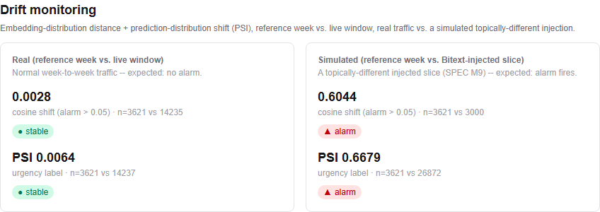
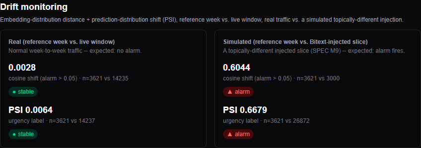

# M9 drift report: embedding-distribution distance + prediction-distribution shift

Generated by `scripts/compute_drift.py` from `eval_runs` rows persisted during this run -- every number below comes from a committed eval run (CLAUDE.md rule #5), nothing here is hand-typed.

Reference week: `2017-10-09`. Live window (real scenario): `2017-11-06, 2017-11-13, 2017-11-20, 2017-11-27`. Both drawn from the real Twitter corpus's stable high-volume tail (~3500-3600 tickets/week) so sample sizes are large enough for a stable centroid/PSI estimate -- see `docs/decisions.md` for the full measurement that picked these weeks and the alarm thresholds below.

## Embedding-distribution distance (centroid cosine shift)

| Scenario | Reference n | Live n | Cosine shift | Alarm (> 0.05) |
|---|---|---|---|---|
| Real (reference week vs. live window) | 3621 | 14235 | 0.0028 | False |
| Simulated (reference week vs. Bitext-injected slice) | 3621 | 3000 | 0.6044 | True |

## Prediction-distribution shift (urgency-label PSI)

| Scenario | Reference n | Live n | PSI | Status |
|---|---|---|---|---|
| Real (reference week vs. live window) | 3621 | 14237 | 0.0064 | stable |
| Simulated (reference week vs. Bitext-injected slice) | 3621 | 26872 | 0.6679 | alarm |

## SPEC M9 acceptance: "a simulated drift scenario... watch the alarms fire"

| Signal | Real scenario | Simulated scenario | Verdict |
|---|---|---|---|
| Embedding distance | no alarm | alarm | PASS |
| Prediction shift (PSI) | no alarm | alarm | PASS |

**PASS** means: the real reference-week-vs-live-window comparison does not fire (normal week-to-week traffic isn't drift), and the simulated topically-different injection does fire (SPEC M9's demonstration).

## Screenshots

The `/metrics` dashboard's drift panel (`apps/dashboard/src/components/drift-panel.tsx`), rendering
exactly the `GET /drift` response backed by the `eval_runs` rows above -- real (left) vs. simulated
(right), light and dark:

